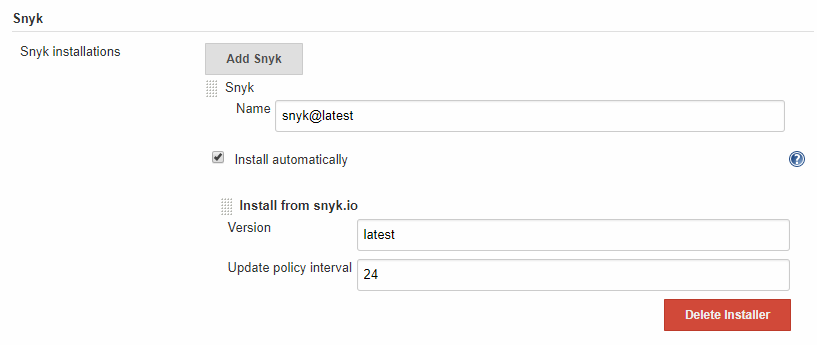
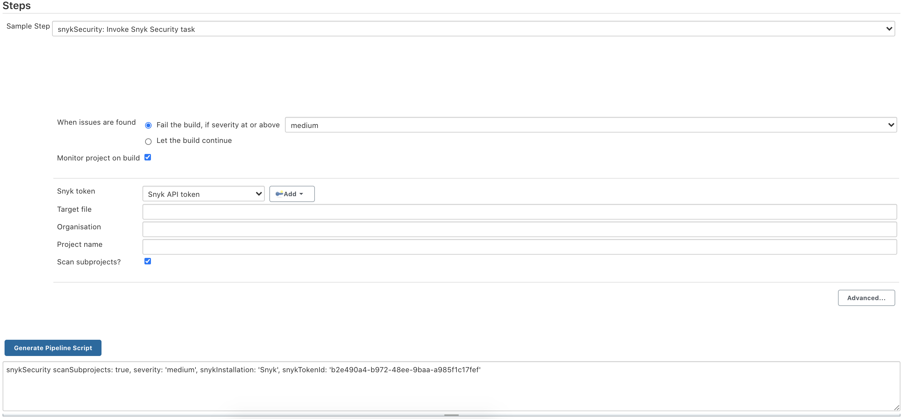
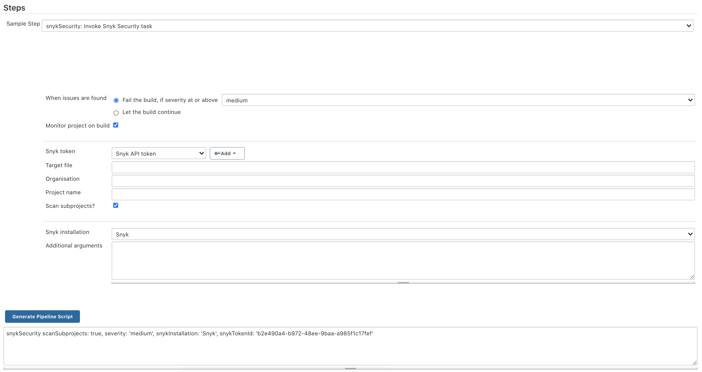

***

# Table of Contents
- [Introduction](#introduction)
- [Configuration](#configuration)
  - [Global Configuration](#global-configuration)
  - [Project Configuration](#project-configuration)
    - [Freestyle Jobs](#freestyle-jobs)
    - [Pipeline Jobs](#pipeline-jobs)
- [Migration from v1](#migration-from-v1)
- [Release Workflow](#release-workflow)
  - [Performing a Plugin Release](#performing-a-plugin-release)
  - [Experimental Plugin Releases](#experimental-plugin-releases)

# Introduction

Snyk Security Scanner is a Jenkins plugin that enables Jenkins users to test their applications against the [Snyk vulnerability database](https://snyk.io/vuln).

# Configuration

## Global Configuration

Configure your Jenkins settings to install the Snyk Security Scanner plugin:
1. Visit **Manage Jenkins > Manage Plugins > Available** and search for `Snyk Security`. Install the plugin.
2. Visit **Manage Jenkins > Global Tool Configuration** and add a **Snyk Installation** to have the Snyk CLI available during Jenkins builds. We recommend using the **latest** version to keep up to date with new releases of the Snyk CLI.

Note: in order to install a pre-released version of the plugin, change the **Update Site** to `http://updates.jenkins-ci.org/experimental/update-center.json` in the **Advanced** settings. See https://jenkins.io/zh/blog/2013/09/23/experimental-plugins-update-center/ for more details.

3. Add a Snyk API Token to Jenkins to allow the Snyk Security Scanner to identify with Snyk.
Visit **Credentials > System**. Specify a meaningful credential ID value in the **ID** field (i.e. `my-org-snyk-api-token`).

## Project Configuration

### Freestyle Jobs

Enable the Snyk Security Scanner in the project configuration page. To add Snyk Security Scanner to the project's build, select **Build > Add build step > Invoke Snyk Security Task**.

#### Basic Configuration

- **When issues are found** - This specifies if builds should be failed or continued based on issues found by Snyk.
- **Monitor project on build** - Take a current application dependencies snapshot for continuous monitoring by Snyk.
- **Snyk token** - The ID for the API token from the Credentials plugin to be used to authenticate with Snyk (credential type must be "Snyk API token").
- **Target file** - The path to the application manifest file to be scanned by Snyk Security Scanner.
- **Organisation** - The Snyk organisation in which this project should be tested and monitored.
- **Project name** - A custom name for the Snyk project created for this Jenkins project on every build.
- **Scan subprojects** - Toggle this if any subprojects should be scanned as well.

#### Advanced Configuration

To see the advanced configuration for the plugin, click the "Advanced" button. This section allows you to specify Snyk installation as well as additional runtime arguments for the Snyk Security Scanner.

- **Snyk installation** - The Snyk installation as configured in the **Global Tool Configuration**.
- **Additional arguments** - Refer to the [Snyk CLI](https://snyk.io/docs/using-snyk/) help page for information on additional arguments.

### Pipeline Jobs

The Snyk Security Scanner pipeline integration exposes the `snykSecurity` function to scan your dependencies as part of your pipeline script. We recommend to use "Snippet Generator" to generate needed step statement you may copy into your Jenkinsfile.

The `snykSecurity` function accepts the following parameters:

- **snykInstallation** - Snyk installation name as configured in the **Global Tool Configuration**.
- **snykTokenId** - The ID of the API token from the Credentials plugin to be used to authenticate to Snyk.
- **additionalArguments** (optional, default **none**) - Refer to the [Snyk CLI](https://snyk.io/docs/using-snyk/) help page for information on additional arguments.
- **failOnIssues** (optional, default **true**) - This specifies if builds should be failed or continued based on issues found by Snyk.
- **organisation** (optional, default **none**) - The Snyk organisation in which this project should be tested and monitored.
- **projectName** (optional, default **none**) - A custom name for the Snyk project created for this Jenkins project on every build.
- **severity** (optional, default **low**) - Only report vulnerabilities of provided level or higher (low/medium/high). Default is low.
- **targetFile** (optional, default **none**) - The path to the manifest file to be used by Snyk.

# Migration from v1

**Note:** the new v2 of the plugin contains incompatible changes to v1 and will require you to adapt your Jenkins jobs. You have to perform global configuration steps as described [here](#global-configuration).

- The plugin does not require Docker installation on master or worker nodes. Add a Snyk installer in **Global Tool Configuration** page to make the CLI available.
- You don't need to pass Snyk API token as `SNYK_TOKEN` environment variable to the job. Add a credential of type "Snyk API token".
- The parameters `Runtime Arguments`, `Docker Image`, `HTTP Proxy` and `HTTPS Proxy` are now obsolete.
- Pipeline syntax was changed, see [Pipeline jobs](#pipeline-jobs) section for documentation.

# Development and Release Workflow

We're using Travis CI to automatically build releases. First make sure the following variables are defined in Travis
[repository settings](https://docs.travis-ci.com/user/environment-variables#defining-variables-in-repository-settings):
- `JENKINS_USERNAME`
- `JENKINS_PASSWORD`

> Note! Currently releases are possible only from `master` and `2.0.0-dev` branches.

## Performing a Plugin Release

1. Create a tag on commit you want to release (form is `x.y.z`). This `x.y.z` will be used as artifact version when deploying to jenkinsci
repository.
2. Check that "Release" stage on Travis was successful.
3. The new version of the plugin should show up in the update center within eight hours.

## Experimental Plugin Releases

To simplify delivery of beta versions of plugins to interested users, the Jenkins project published an *experimental update center*. It will
include alpha and beta versions of plugins, which are not usually included in the regular update sites.

Releases that contain `alpha` or `beta` in their version number will only show up in the experimental update site, e.g. `2.0.0-alpha-1`.

To configure Jenkins to use experimental update site please follow this [tutorial](https://jenkins.io/doc/developer/publishing/releasing-experimental-updates).

## Troubleshooting

To troubleshoot the plugin, add a logger to capture all `io.snyk.jenkins` logs. Follow [this article](https://support.cloudbees.com/hc/en-us/articles/204880580-How-do-I-create-a-logger-in-Jenkins-for-troubleshooting-and-diagnostic-information-) to add a logger and re-run the Snyk Security job once again to capture logs.

This plugin will attempt to download and install the Snyk CLI. If the installation of the Snyk CLI fails, your CI job will fail and you should see the error `Snyk Security tool could not installed` in the CI logs. If this is the case, it is likely either a permissions related mis-configuration on your Jenkins master or agents or a network issue.
