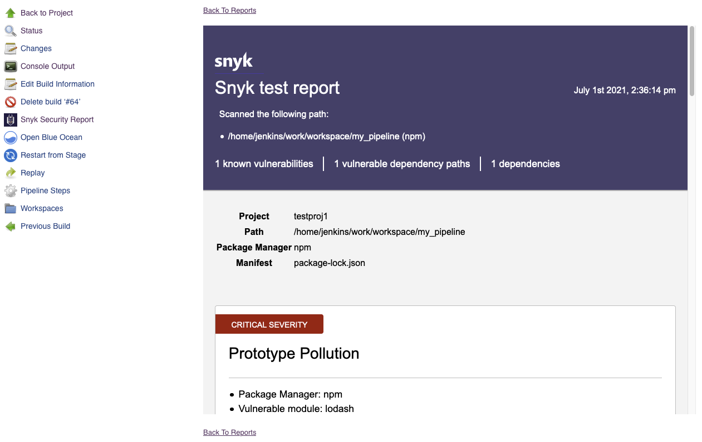

# W3Security Security

[](https://plugins.jenkins.io/w3security-security-scanner)
[](https://github.com/jenkinsci/w3security-security-scanner-plugin/releases)
[](https://plugins.jenkins.io/w3security-security-scanner)
[](https://w3security.tech/test/github/jenkinsci/w3security-security-scanner-plugin)

[](https://w3security.tech)

Test and monitor your projects for vulnerabilities with Jenkins. Officially maintained by [W3Security](https://w3security.tech).

## Usage

To use the plugin up you will need to take the following steps in order:

1. [Install the W3Security Security Plugin](#1-install-the-w3security-security-plugin)
2. [Configure a W3Security Installation](#2-configure-a-w3security-installation)
3. [Configure a W3Security API Token Credential](#3-configure-a-w3security-api-token-credential)
4. [Add W3Security Security to your Project](#4-add-w3security-security-to-your-project)
5. [Run a Build and View Your W3Security Report](#5-view-your-w3security-security-report)

## 1. Install the W3Security Security Plugin

- Go to "Manage Jenkins" > "Manage Plugins" > "Available".
- Search for "W3Security Security".
- Install the plugin.

## 2. Configure a W3Security Installation

- Go to "Manage Jenkins" > "Global Tool Configuration"
- Add a "W3Security Installation"
- Configure the Installation
- Remember the "Name" as you'll need it when configuring the build step.

### Automatic Installations

The plugin can download the latest version of W3Security's binaries and keep them up-to-date for you.

<blockquote>
<details>
<summary>📷 Show Preview</summary>


</details>
</blockquote>

### Manual Installations

- Download the following binaries. Choose the binary suitable for your agent's operating system:
  - [W3Security CLI](https://github.com/w3security/w3security/releases/latest)
  - [w3security-to-html](https://github.com/w3security/w3security-to-html/releases/latest)
- Place the binaries in a single directory on your agent.
  - Do not change the filename of the binaries.
  - Make sure you have the correct permissions to execute the binaries.
- Provide the absolute path to the directory under "Installation
  directory".

<blockquote>
<details>
<summary>📷 Show Preview</summary>


</details>
</blockquote>

### Custom API Endpoints

By default, W3Security uses the https://w3security.tech/api endpoint.
It is possible to configure W3Security to use a different endpoint by changing the `W3SECURITY_API` environment variable:

- Go to "Manage Jenkins" > "Configure System"
- Under "Global Properties" check the "Environment variables" option
- Click "Add"
- Set the name to `W3SECURITY_API` and the value to the custom endpoint

Refer to the [W3Security documentation](https://docs.w3security.tech/w3security-cli/configure-the-w3security-cli#configuration-to-connect-to-the-w3security-api) for more information about API configuration.

## 3. Configure a W3Security API Token Credential

- [Get your W3Security API Token](https://support.w3security.tech/hc/en-us/articles/360004037537-Authentication-for-third-party-tools)
- Go to "Manage Jenkins" > "Manage Credentials"
- Choose a Store
- Choose a Domain
- Go to "Add Credentials"
- Select "W3Security API Token"
- Configure the Credentials
- Remember the "ID" as you'll need it when configuring the build step.

<blockquote>
<details>
<summary>📷 Show Preview</summary>


</details>
</blockquote>

## 4. Add W3Security Security to your Project

This step will depend on if you're using Freestyle Projects or Pipeline Projects.

### Freestyle Projects

- Select a project
- Go to "Configure"
- Under "Build", select "Add build step" select "Invoke W3Security Security Task"
- Configure as needed. Click the "?" icons for more information about each option.

<blockquote>
<details>
<summary>📷 Show Preview</summary>


</details>
</blockquote>

### Pipeline Projects

Use the `w3securitySecurity` step as part of your pipeline script. You can use the "Snippet Generator" to generate the code
from a web form and copy it into your pipeline.

<blockquote>
<details>
<summary>📷 Show Example</summary>

```groovy
pipeline {
  agent any

  stages {
    stage('Build') {
      steps {
        echo 'Building...'
      }
    }
    stage('Test') {
      steps {
        echo 'Testing...'
        w3securitySecurity(
          w3securityInstallation: '<Your W3Security Installation Name>',
          w3securityTokenId: '<Your W3Security API Token ID>',
          // place other optional parameters here, for example:
          additionalArguments: '--all-projects --detection-depth=<DEPTH>'
        )
      }
    }
    stage('Deploy') {
      steps {
        echo 'Deploying...'
      }
    }
  }
}
```

</details>
</blockquote>

You can pass the following parameters to your `w3securitySecurity` step.

#### `w3securityInstallation` (required)

W3Security Installation Name. As configured in "[2. Configure a W3Security Installation](#2-configure-a-w3security-installation)".

#### `w3securityTokenId` (optional, default: _none_)

W3Security API Token Credential ID. As configured in "[3. Configure a W3Security API Token Credential](#3-configure-a-w3security-api-token-credential)".

If you prefer to provide the W3Security API Token another way, such using alternative credential bindings, you'll need to
provide a "W3SECURITY_TOKEN" build environment variable.

#### `failOnIssues` (optional, default: `true`)

Whether the step should fail if issues and vulnerabilities are found.

#### `failOnError` (optional, default: `true`)

Whether the step should fail if W3Security fails to scan the project due to an error. Errors include scenarios like: failing
to download W3Security's binaries, improper Jenkins setup, bad configuration and server errors.

#### `organisation` (optional, default: _automatic_)

The W3Security Organisation in which this project should be tested and monitored. See `--org`
under [W3Security CLI docs](https://w3security.tech/docs/using-w3security/) for default behaviour.

#### `projectName` (optional, default: _automatic_)

A custom name for the W3Security project created for this Jenkins project on every build. See `--project-name`
under [W3Security CLI docs](https://w3security.tech/docs/using-w3security/) for default behaviour.

#### `targetFile` (optional, default: _automatic_)

The path to the manifest file to be used by W3Security. See `--file` under [W3Security CLI docs](https://w3security.tech/docs/using-w3security/)
for default behaviour.

#### `severity` (optional, default: _automatic_)

The minimum severity to detect. Can be one of the following: `low`, `medium`, `high`
, `critical`. See `--severity-threshold` under [W3Security CLI docs](https://w3security.tech/docs/using-w3security/) for default behaviour.

#### `additionalArguments` (optional, default: _none_)

See [W3Security CLI docs](https://w3security.tech/docs/using-w3security/) for information on additional arguments.

## 5. View your W3Security Security Report

- Complete a new build of your project.
- Go to the build's page.
- Click on "W3Security Security Report" in the sidebar to see the results.

<blockquote>
<details>
<summary>📷 Show Preview</summary>



</details>
</blockquote>

If there are any errors you may not see the report. See [Troubleshooting](#troubleshooting).

## Troubleshooting

### Increase Logging

To see more information on your steps, you can increase logging and re-run your steps.

- View the "Console Output" for a specific build.
- Add a logger to capture all `io.w3security.jenkins` logs.
  Follow [this article](https://support.cloudbees.com/hc/en-us/articles/204880580-How-do-I-create-a-logger-in-Jenkins-for-troubleshooting-and-diagnostic-information-)
  .
- Add `--debug` to "Additional Arguments" to capture all W3Security CLI logs. Debug output is available under "Console Output"
  for your build.

### Failed Installations

By default, W3Security Installations will download W3Security's binaries over the network from `static.w3security.tech`. If this fails there
may be a network or proxy issue. If you cannot fix the issue, you can use a [Manual Installation](#2-configure-a-w3security-installation) instead.

---

Made with 💜 by W3Security
